# Introduction to GitHub
## Introduction
 In this piece of article, I will cover the basic things you need to know about Git and GitHub. Which includes what is Git and GitHub, why you need GitHub, differences between Git and GitHub. I will also have a step guide on how to Clone on GitHub, how to perform a pull request on GitHub, and also how to commit on GitHub. I will be making use of both the GitHub Desktop and the CLI. And ultimately, it will be much easier for you to understand the basic knowledge of GitHub.

 ## What is Git
 Git can be defined as a standalone control system, software used by programmers or computer technicians to track any changes in their source code during software development. Git is free, open-source, and developed by Linus Torvalds in 2005. Git can work offline on our local computers.

 ## What is GitHub
 GitHub can be seen as a social media website for computer programmers that connects them to enable them to work from different locations. Git itself is gotten from the original Git software name as explained above. Hub plays two roles: a folder where Git is stored and a connection point for programmers and computer technicians to access stored files remotely instead of locally within their system alone.

 ## Why GitHub
I know this will be the following question to ask, many will have this in mind to know why it is important or necessary to use GitHub. I will give out a summary of reasons GitHub is important and why is needed.
* GitHub is free.
* GitHub is a web-based Cloud hosting, which makes it easier to access.
* GitHub makes team Collaboration much easier.
* GitHub has a central server for each Project or Repository, which makes it easier for developers to track changes and upload them back to the server.

## Git vs. GitHub
Sometimes we get confused about Git and GitHub. So in this section, I will explain clearly the difference between Git and GitHub. Check out the following table:

| Serial Number | Git                       | GitHub
----------------| ------------------------- | ------------------------------------ |
| 1             | Git is a standalone Software | GitHub is a Cloud hosting service |
| 2             | Git is installed locally on a computer | GitHub is hosted on the world wide web |
| 3             | Git is simply a command-line tool | GitHub is a graphic user interface tool |
| 4             | Git is primarily concerned with code sharing and version control | The primary goal of GitHub is to host centralized source code |
| 5             | Linux supports Git        | Microsoft supports GitHub |
| 6             | Git is a version control tool for maintaining the history of source code | Git repositories can be hosted on GitHub |
| 7             | Git was officially made publicly available in 2005 | In 2008, GitHub was launched |
| 8             | The license for Git is open-source | Free and paid tiers are available on GitHub |
| 9             | Git lacks a user management function | There is a user management function incorporated into GitHub |
| 10            | Git just configures a few external tools | For tool integration, GitHub has an active marketplace |

## GitHub Desktop vs. Github CLI
In this section, I will talk more about what is GitHub Desktop, What is GitHub CLI, including the differences between them. 

## What is GitHub Desktop
GitHub Desktop is a software or an application built by the GitHub team to enable us to interact with our GitHub account using a Graphic User Interface, instead of using the command line or the web browser. You can download one **[here](https://desktop.github.com/)**

## What is GitHub CLI
GitHub CLI is designed to enable us to use GitHub from our computer terminal or command line. GitHub CLI helps you to save time and avoid switching contexts. It is also an open-source tool. 

## Difference between GitHub Desktop and GitHub CLI

The difference between GitHub Desktop and GitHub CLI is as follows:

| Serial Number | GitHub Desktop                      | GitHub CLI
----------------| ------------------------- | ------------------------------------ |
| 1             | GitHub Desktop uses Graphic User Interface to interact | GitHub CLI makes use of Terminal and command lines to perform actions |
| 2             | GitHub Desktop is interactive | GitHub CLI is a black screen and may be difficult to interact with |
| 3             | GitHub Desktop makes use of buttons for commands | GitHub CLI makes use of code syntax for commands |

## Clone
In this section of this article, I will guide you on how to Clone a Repository or Project on GitHub using both GitHub Desktop and CLI. But first, let us look at what is Clone.

## What is Clone

Clone is the process of copying a Repository or Project from an online storage website like GitHub or anywhere on the internet to your local computer. 

## How to Clone on GitHub Desktop

Before we Clone on GitHub Desktop, we need to have an account with GitHub, Download the GitHub Desktop, and log in using our GitHub login details. If you don't have GitHub Desktop yet, you can download one **[here](https://desktop.github.com/)**, also create an account **[here](https://github.com/signup)** if you don't have one yet. 

After a successful download and installation of the GitHub Desktop, make sure you are connected to the internet, log in and follow these steps:

1. Click **Clone a repository from the internet** or Click **File >** **Clone repository**.
   
     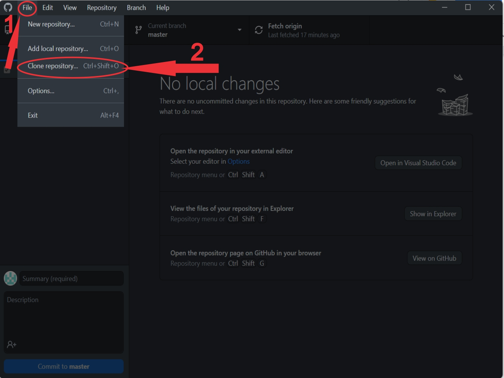

2. Click **URL** Tab
   
     

    a. For **URL**, Paste the Repository link from the GitHub repo. ( **example:** https://github.com/mrtrice/Technical-Writing/blob/main/Technical-Writing-Assignments/Introduction-To-GitHub-Assignment/intro-to-github.md)

    b. For **Local Path**, Select the location you want to save the repository on your **local computer**.

    c. Click **Clone**.

    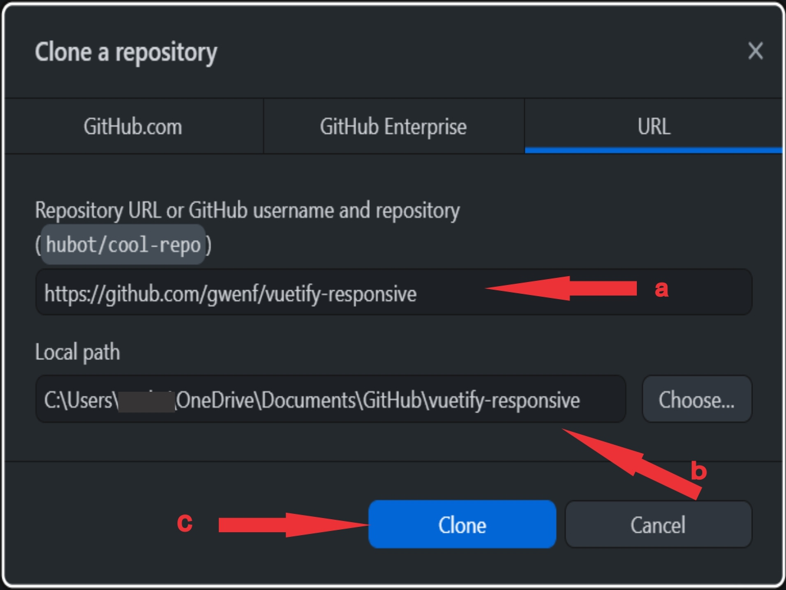

The Clone Process will start and should take a few seconds, depending on the Repository file size.

## How to Clone on CLI
To clone with CLI, we need CLI software, such as Git Bash, Command Prompt, and Windows Power shell (Terminal). First, we have to understand what is CLI. CLI simply means Command-Line. In this case, we use code commands to act. I will be using Git Bash for this process and will be making use of Windows 11 operating system. To clone on CLI, follow these steps: 

1. Click **Search bar** on your computer taskbar.
   
   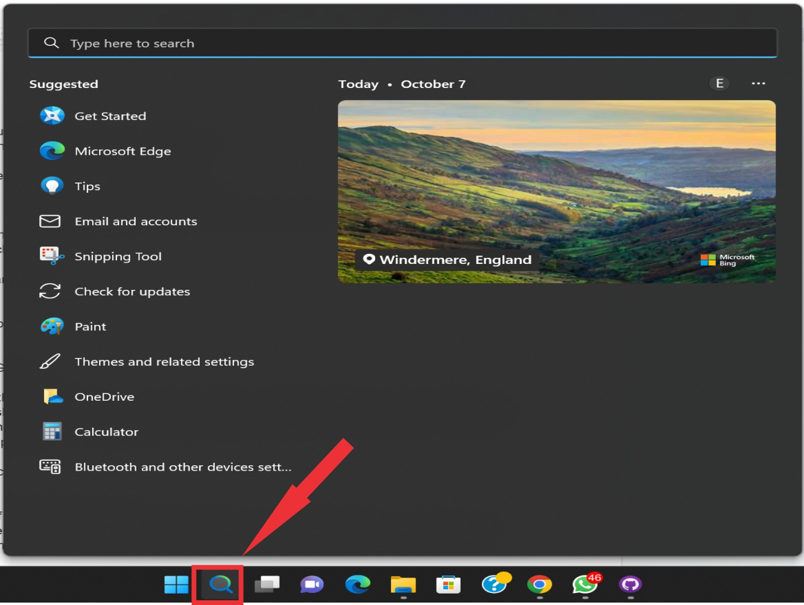

2. Type **Git Bash** on the search bar.
   
   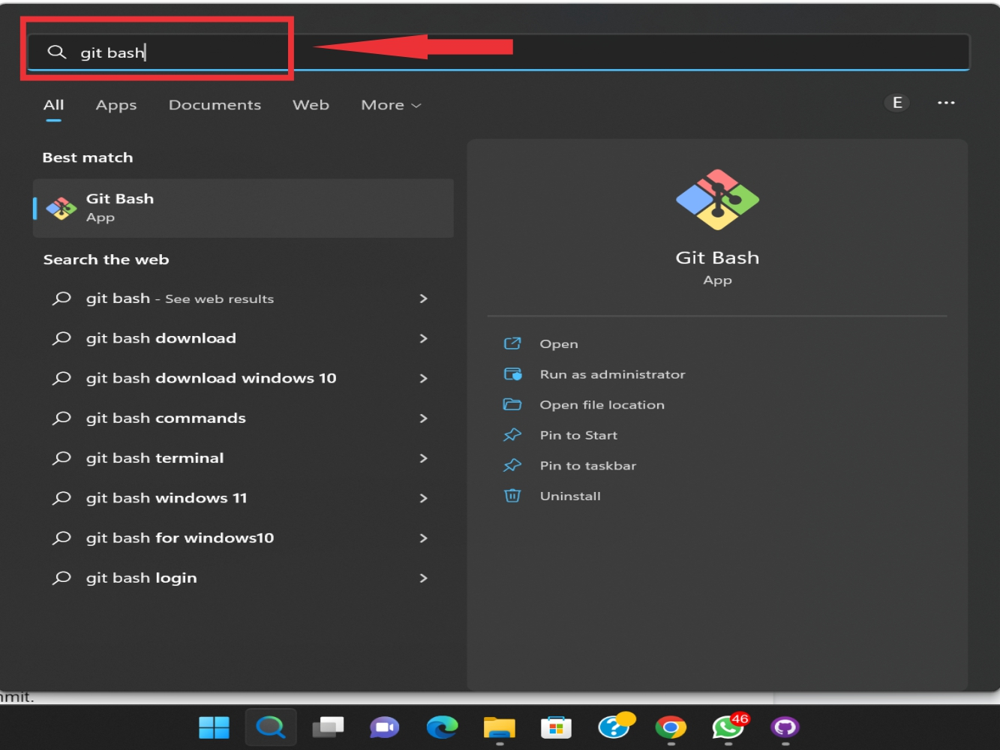

3. Click **Git Bash icon**.
   
   

4. Type **git clone** **<REMOTE_URL>**

    a. For **<REMOTE_URL>**, Paste the Repository link from the GitHub repo.

    

5. Tab **Enter Key**.

The Clone will start processing and should take a few seconds, depending on the Repository file size. 

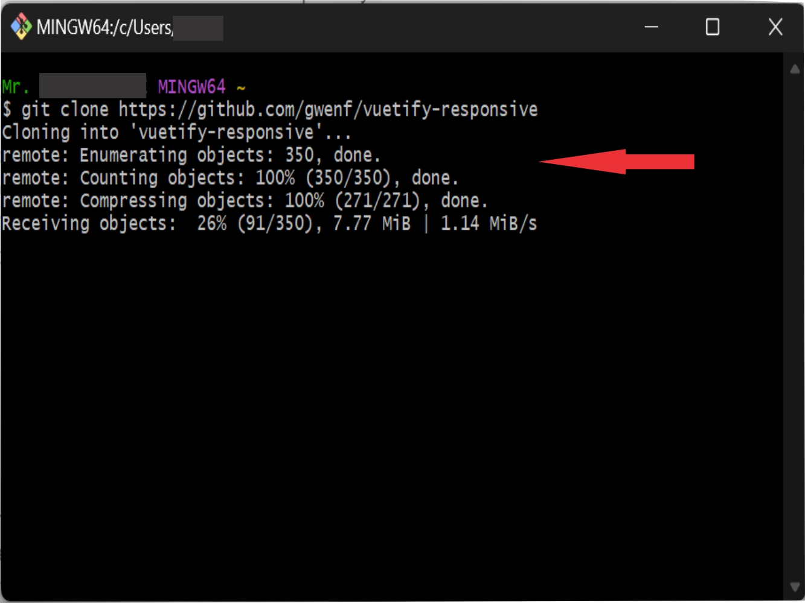

## Commit
Another section of this article is Commit, in this section, I will guide you on how to commit a Repository or Project on GitHub using both GitHub Desktop and CLI. Before that, let us look at what is Commit.

## What is Commit
Commit simply means to save the changes you made in your files to the repository or project.

## How to Commit on GitHub Desktop
To Commit on the GitHub desktop, requirements are still the same as explained earlier above. login in other to see the Repository you cloned earlier or any of the Repositories you already have. Before I commit, I need to make changes to the Repository first. To make changes, follow these steps:

1. Open **GitHub Desktop**.
   
   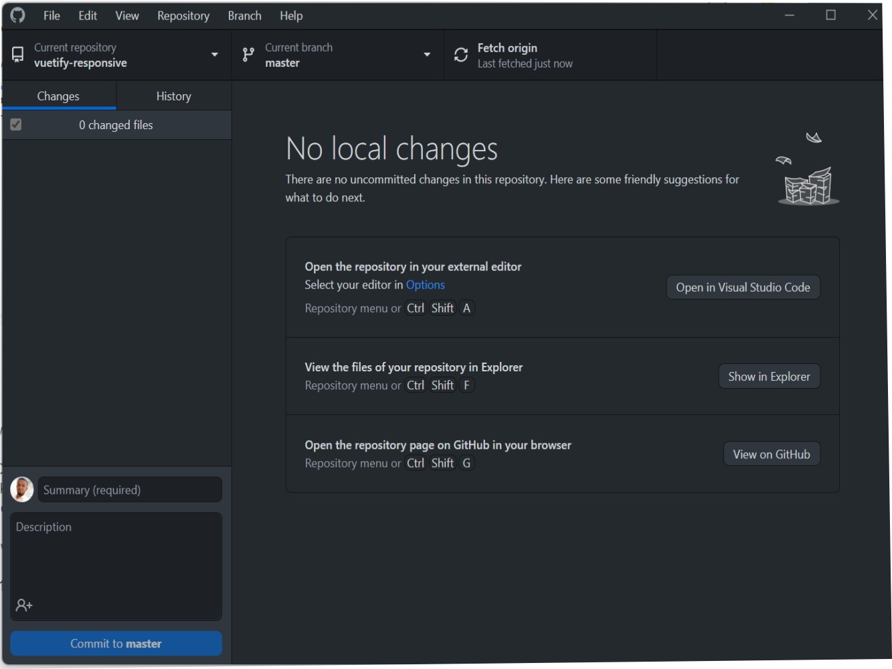
2. Click **Dropdown Arrow**.
   
   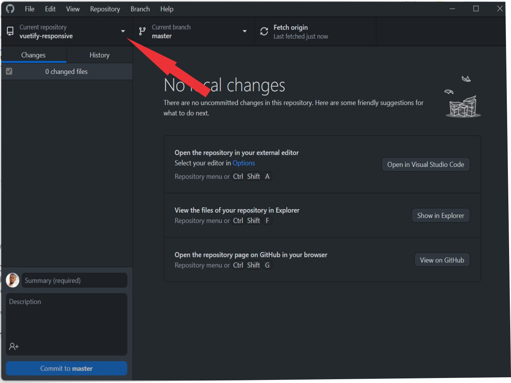

3. Choose a **Repository** or use the **Add Button** to Add one.
   
   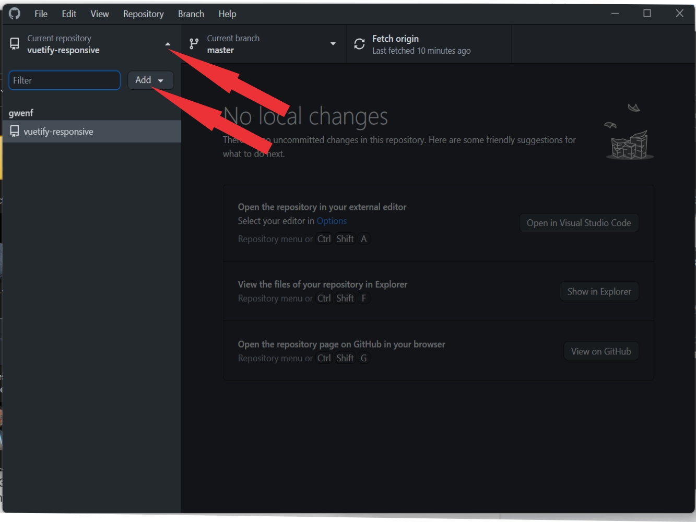

    a. In my case, I will choose an existing Repository **“Vuetify-responsive”**.

    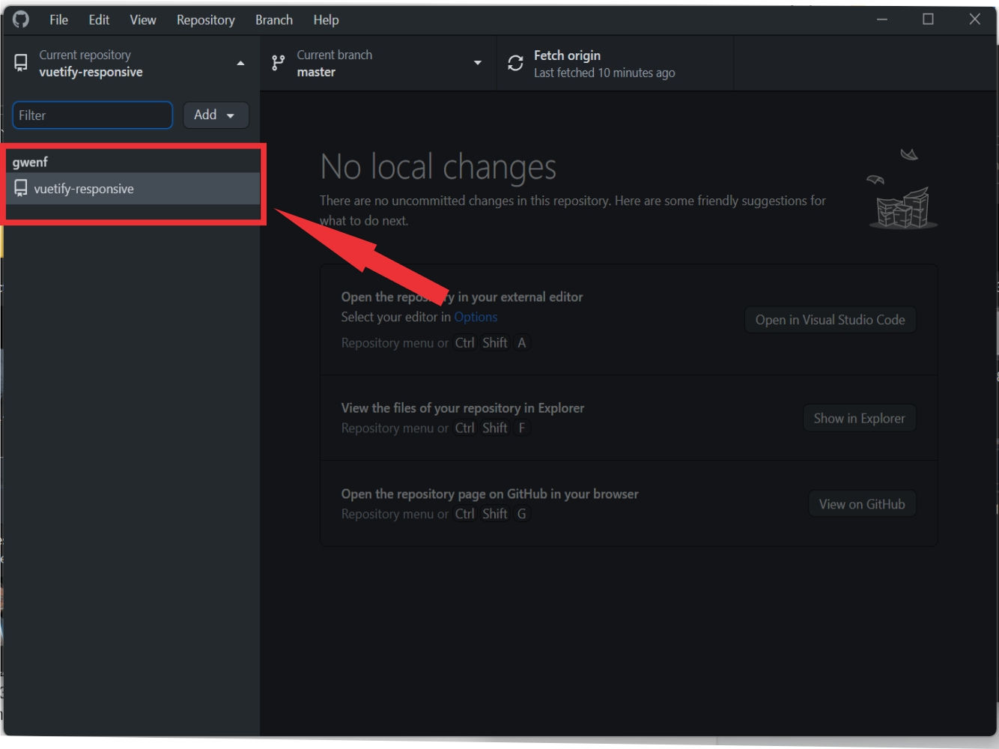

    b. You can see we have 0 changed files under my changes tab as shown below:
   
    

4. Click **Open in Visual Studio Code** (Download Visual Studio Code **[here](https://code.visualstudio.com/download)** if you dont have one).

   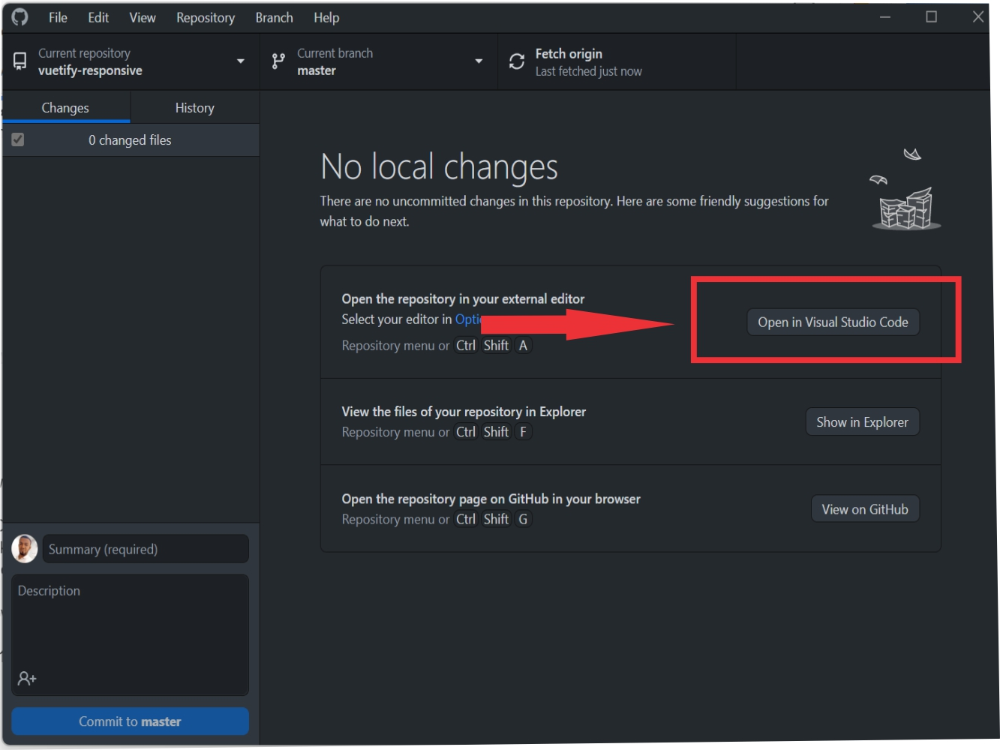

5. Click **Yes, I trust the authors**, if such occur.

   

6. Select a **File from the left panel** to make changes.

   

7. Edit File.

   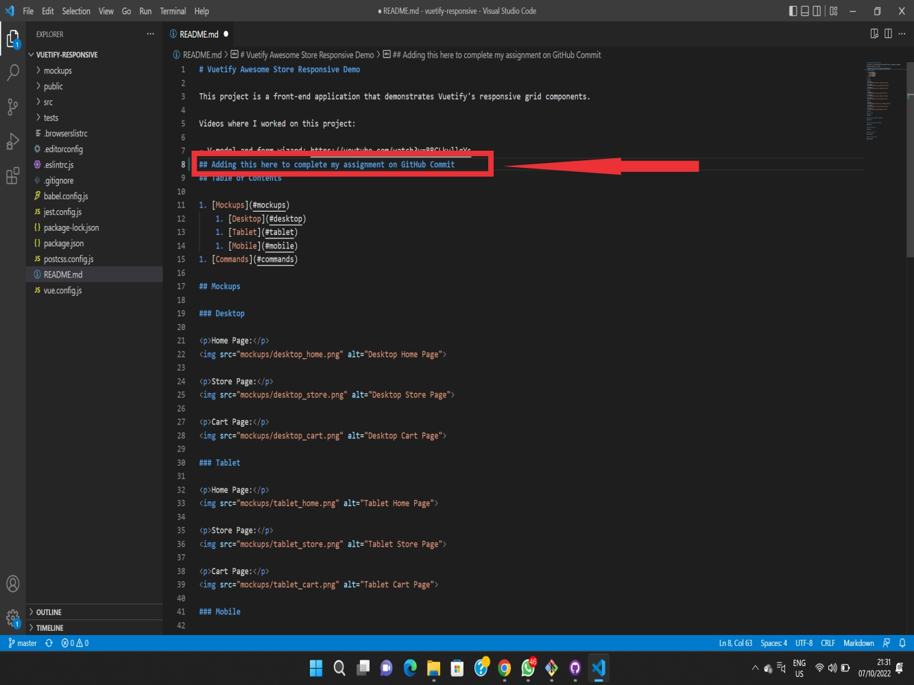

8. Save File. 
   
      a. **File** > **Save**.

      b. For Windows, **Ctl + S**.

      c. For Mac, **Command + S**.

9. Open **GitHub Desktop**.

You can see we have 1 changed file under my changes tab as shown below 

10. Click **Commit to master**

    

We have successfully Committed using the GitHub Desktop as shown below

## How to Commit on CLI
As I mentioned above, I will be making use of Git Bash software for this process. To Commit, you must have done changes in a file and wish to commit the file. To Commit, follow these steps:

1. Open **File** on Visual Studio Code or any Text Editor you have.
2. Edit **File**.
3. Save **File** 

     a. **File** > **Save**.

     b. For Windows, **Ctl + S**.

     c. For Mac, **Command + S**.

4. Open **Git Bash** (Follow steps above)
5. Type **cd Repository Name**.
   
   
   
   a. For **Repository Name**, Paste or type the Repository link or file name from your local computer.
   
6. Tab **Enter key**.

   

7. Type **git status**.

   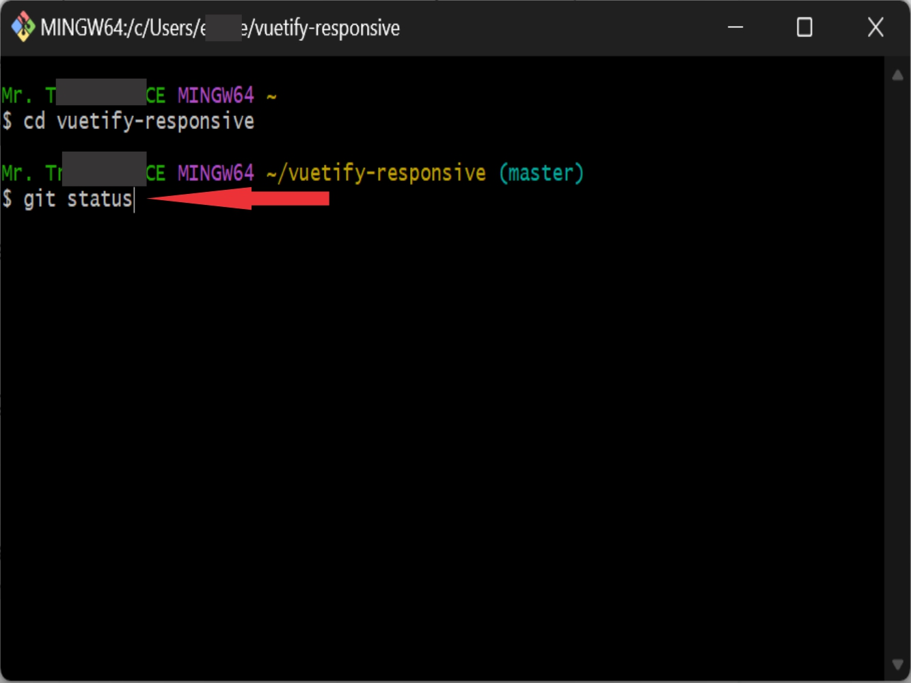

8. Tab **Enter Key**.

    

    a. **Modified**: The file in red is the edited file but is not ready to commit yet.

9. Type **git add README.md**.

   

10. Tab **Enter key**.

11. Type **git status**.

    

12. Tab **Enter Key**.

    a.  **Modified**: The file in green is the edited file and is ready to commit.

    

13. Type **git commit -m "commit message" -m "commit message description"**
    
    a. For **-m**: This means message syntax.

    b. For **Commit message**: Title of the message you wish to write.

    c. For **Commit message description**: Message description.

    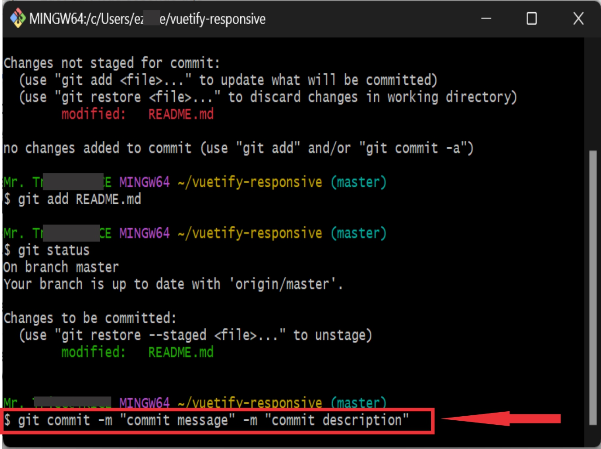

14. Tab **Enter Key**

    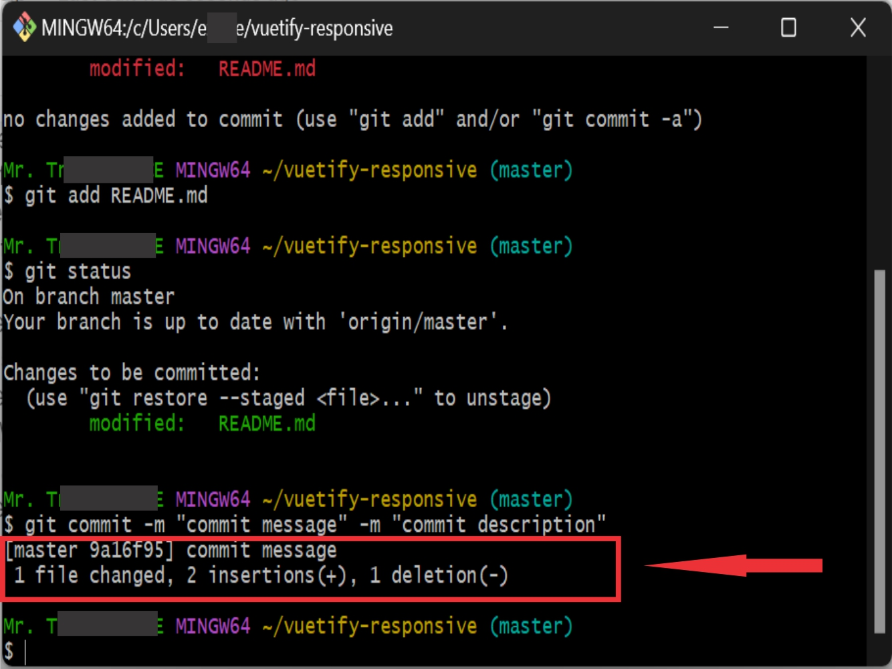

## Pull request
In this section, I will guide you on how to Pull request on GitHub Desktop and CLI. But first,  we need to know what is Pull request.

## What is Pull Request
This is a process a developer or a computer technician used to inform the team about changes made to a file in Repository. 

## How to Pull Request on GitHub Desktop

In this section, I will assume you have committed the repository already as discussed above. If you dont know what is Commit, I will recommend you check the previous section of this article for that. Click [here](#commit) to read. To pull request on GitHub Desktop, follow these steps:

1. Open **GitHub Desktop** (Follow steps above).
2. Select **Repository** to Pull request.
3. Click **Push Origin**.

   

## How to Pull request on CLI
In this section, I will be making use Git Bash software for this process. To Pull a request, you must have Committed the repository already as discussed above. To Pull Request, follow these steps:

1. Open **Git Bash** (See steps above).
2. Type **cd Repository Name**.
   
   a. For **Repository Name**, Paste or type the Repository link or file name from your local computer.

3. Tab **Enter key**.
4. Type **git status**.
5. Type **git push**.

    

## Conclusion
With all being said above, I believe it will be much easier to understand a little about GitHub and how it functions. We can also see that, there are many differences between the two called GitHub and Git. Knowing fully well that GitHub is not just a website but more than a website. This means it's a connector that connects computer programmers or anything related to that together for easy accessibility of files to fasten works remotely. 

